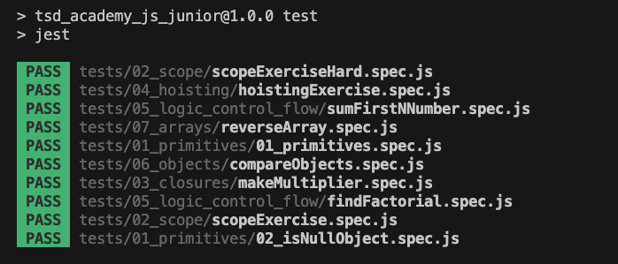

### TSD Academy - JavaScript Junior Action Item 🚀

The purpose of this exercise package is simple - to help you understand fundamental JavaScript concepts. Your goal is to make the tests pass in a TDD(Test-Driven-Development) fashion. 🎯


### Getting Started 🛠️

1. Run `npm install` to install dependencies.
2. Run `npm test` to run the Jest tests.
3. Make all the test pass by completing the exercises for each topic.

At the end of the exercise all the test should pass:



---

⚠️⚠️⚠️ 
**Do not use AI tools like Copilot or ChatGPT to solve this Action Item. In most interviews, you will be asked to disabled those.**⚠️⚠️⚠️


---

## 01 - Primitives 🎈

Understand the basic data types in JavaScript. In your terminal run:
```bash
npm test 01_primitives
```
The tests should fail like this:


Implement the following functions to make the tests pass:
1. [getDataType](src/01_primitives/01_getDataType.js)
2. [isNullObject](src/01_primitives/02_isNullObject.js)

⚠️ Run the tests again and make sure they pass before you move on! ⚠️ 

---

## 02 - Scope 🌌

Learn about the different scopes in JavaScript.

- Global Scope
- Function Scope
- Block Scope

Run the tests for this section:
```bash
npm test 02_scope
```

Make the tests pass by completing the code in [02_scope](src/02_scope).

---

## 03 - Closures 📦

Get a grasp on how closures work.

- What are closures?
- Why are they useful?


Run the tests for this section:
```bash
npm test 03_closures
```

Make the tests pass by completing the code in [03_closures](src/03_closures).


---

## 04 - Hoisting ⬆️

Dive into the JavaScript hoisting mechanism.

- What gets hoisted?
- What doesn't?

Run the tests for this section:
```bash
npm test 04_hoisting
```

Make the tests pass by completing the code in [04_hoisting](src/04_hoisting).

---

## 05 - Logic & Control Flow 🔄

Practice the control flow statements in JavaScript.

- `while` loop
- `for` loop

Run the tests for this section:
```bash
npm test 05_logic_control_flow
```

Make the tests pass by completing the code in [05_logic_control_flow](src/05_logic_control_flow).

---

## 06 - Objects 🏢

Learn about the characteristics of objects.

- Properties
- Methods
- Object Equality

Run the tests for this section:
```bash
npm test 06_objects
```

Make the tests pass by completing the code in [06_objects](src/06_objects/).

---

## 07 - Arrays 🍇

Understand the different aspects of arrays.

- Creating Arrays
- Array Methods
- Multi-dimensional Arrays


Run the tests for this section:
```bash
npm test 07_arrays
```

Make the tests pass by completing the code in [07_arrays](src/07_arrays).

---

## Resources 📚

- [MDN JavaScript Guide](https://developer.mozilla.org/en-US/docs/Web/JavaScript/Guide)
- [Eloquent JavaScript](https://eloquentjavascript.net/)

---


##### Getting Feedback & Help
If you have issues with the **Action Item**, you can ask for help in the [Community](https://www.skool.com/devmastery-academy-8041).

Made with 🧡 in Berlin by @TheSeniorDev