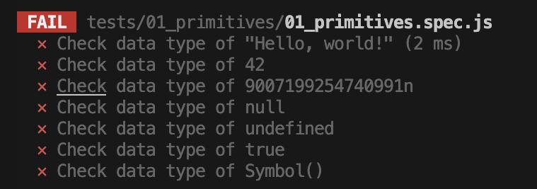

### TSD Academy - JavaScript Junior Action Item 🚀

The purpose of this exercise package is simple - to help you understand fundamental JavaScript concepts. Your goal is to make the tests pass. 🎯

### Getting Started 🛠️

1. Run `npm install` to install dependencies.
2. Run `npm test` to run the Jest tests.
3. Make all the test pass by completing the exercises for each topic.


---

## 01 - Primitives 🎈

Understand the basic data types in JavaScript. In your terminal run:
```bash
npm test 01_primitives
```
The tests should fail like this:


Implement the following functions to make the tests pass:
1. [getDataType](src/01_primitives/01_getDataType.js)
2. [isNullObject(src/01_primitives/02_isNullObject.js)]

⚠️ Run the tests again and make sure they pass before you move on! ⚠️ 

---

## 02 - Scope 🌌

Learn about the different scopes in JavaScript.

- Global Scope
- Function Scope
- Block Scope

---

## 03 - Closures 📦

Get a grasp on how closures work.

- What are closures?
- Why are they useful?

---

## 04 - Hoisting ⬆️

Dive into the JavaScript hoisting mechanism.

- What gets hoisted?
- What doesn't?

---

## 05 - Logic & Control Flow 🔄

Practice the control flow statements in JavaScript.

- `if`, `else if`, `else`
- `while` loop
- `for` loop

---

## 06 - Objects 🏢

Learn about the characteristics of objects.

- Properties
- Methods
- Object Equality

---

## 07 - Arrays 🍇

Understand the different aspects of arrays.

- Creating Arrays
- Array Methods
- Multi-dimensional Arrays

---

## 08 - The Module System - Introduction 📚

Explore the different strategies for module management in JavaScript.

- Global Namespace
- IIFE
- Namespacing
- CommonJS
- AMD
- ES Modules

---

## Resources 📚

- [MDN JavaScript Guide](https://developer.mozilla.org/en-US/docs/Web/JavaScript/Guide)
- [Eloquent JavaScript](https://eloquentjavascript.net/)

---


##### Getting Feedback & Help
If you have issues with the **Action Item**, you can ask for help in the [Community](https://www.skool.com/devmastery-academy-8041).

Made with 🧡 in Berlin by @TheSeniorDev